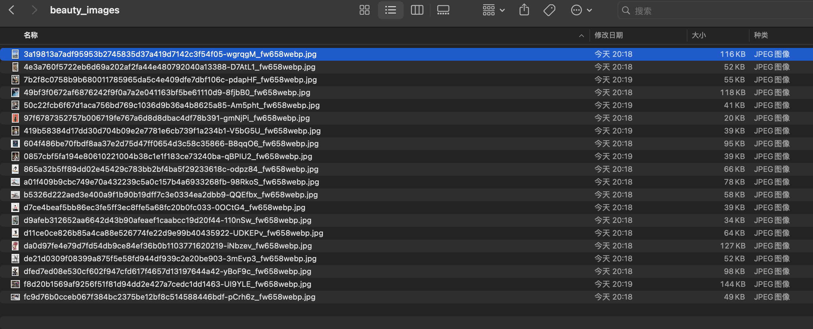

# scrapy_beauty

[](http://github.com/hhyo/archery/blob/master/LICENSE)
[](https://www.python.org/downloads/release/python-375/)

## 一、项目说明

通过scrapy框架，爬虫获取27270.com站点中国美女、韩国美女等标签下的高清美女图片


## 二、效果图



## 三、部署

### 3.1 获取代码

```bash
git clone https://github.com/sunnywalden/scrapy_beauty.git
```
### 3.2 安装依赖

```bash
pip install -r requirements.txt
```

### 3.3 运行项目

```bash
scrapy crawl siwa
```


## 四、感谢

代理使用了jhao104的[proxy_pool](https://github.com/jhao104/proxy_pool)项目，在此感谢！

